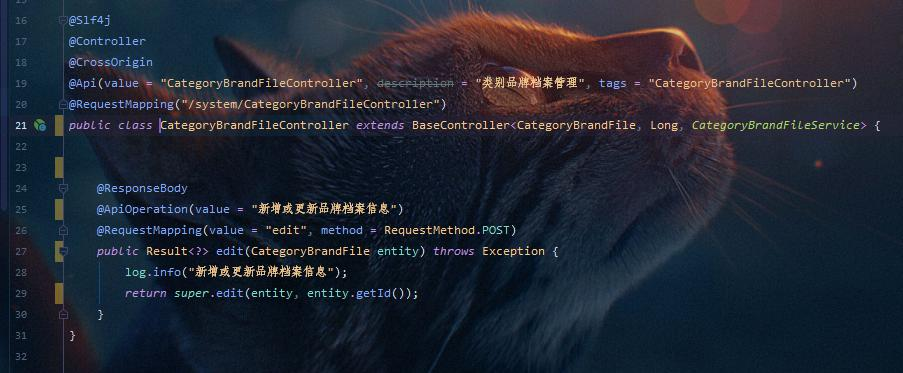
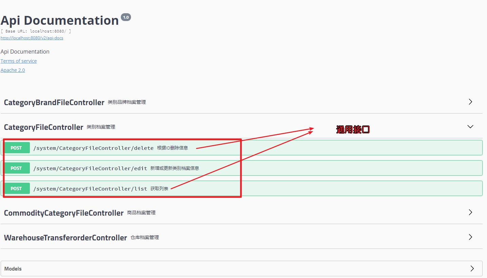
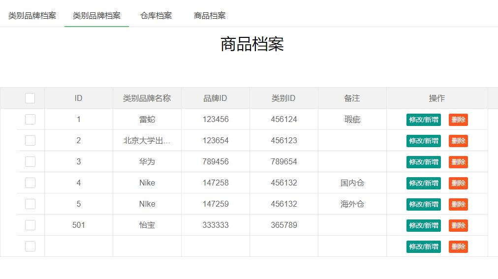
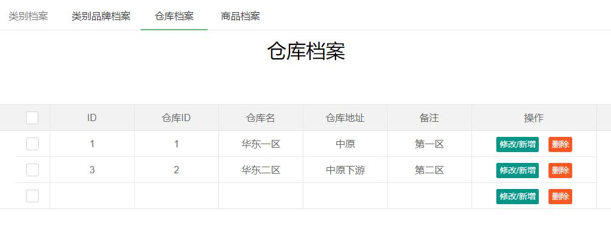
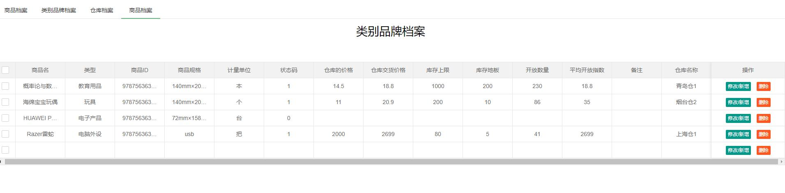
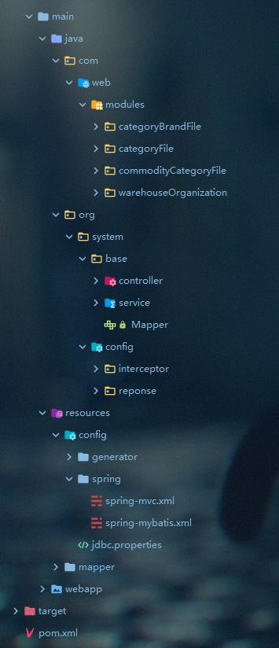
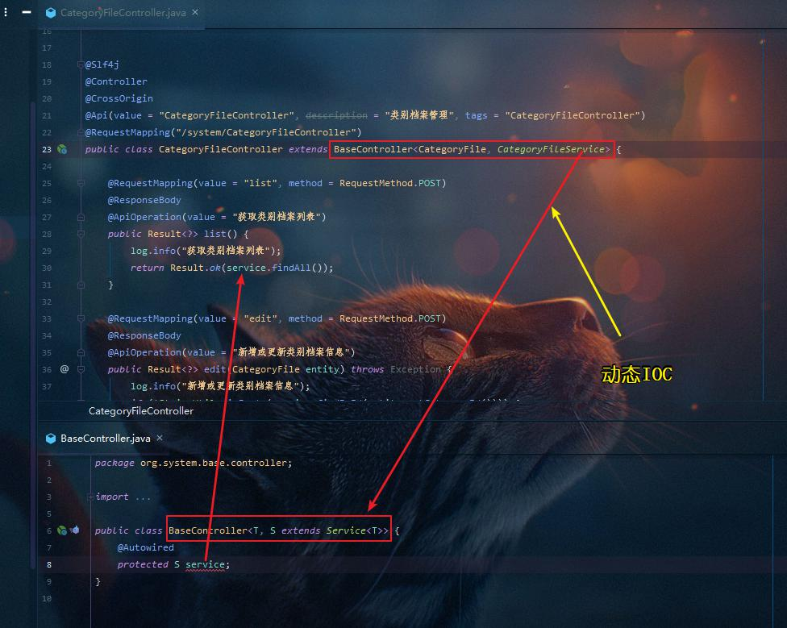
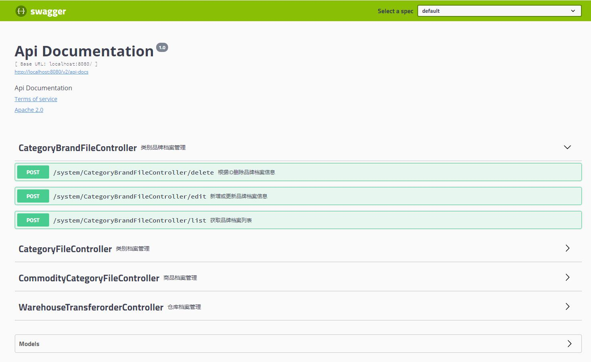

##	record_system(档案管理系统)
    档案管理系统是一个学习代码的阶段性考察而做的系统，主要是研究框架使用特性及代码书写时的设计思想而作，其本身的作用在某种程度上并不是特别有用的，有兴趣的可以作为参考代码。
    
---
###	1.项目介绍
 record_system 是一个档案管理系统，基于ssm框架开发，开发的主要目的是对ssm系统的回顾复习，其实用性并不是很大，但在代码风格上未尝没有借鉴意义。
 
 该项目的数据库表为志愿者随机提供的，感谢 志愿者 [Ning]。
 
### 2.框架介绍
> 简单的CURD操作
>
> 无需书写多余的逻辑算法
>
> 无需sql注入
>
> 通用CURD
>
> 动态 IOC 代理

V2版改进意见：这里的高复用可以很好地兼容CURD这些基本操作，该项目中的新增和更新接口由于最初数据库的字段原因暂时没有改装成通用接口，但是仍然存在复用的方法
----
在此建议：当数据库字段设计合理并且一致时，所有的CURD功能接口皆可使用通用接口代替
#### 技术支持
1. Spring
2. Spring MVC
3. Mybatis
4. MySql 57
5. TK Mybatis
6. Swagger
7. Lombok
8. generator
9. Tomcat 8
10. Slf4j
11. Maven
12. 前端 LayUI

#### 3.项目截图
##### V2 版 - 改进截图

- 代码简化，使用通用接口代替，减少代码书写

- 接口预览 - 测试功能正常使用

##### V1 版

- 项目架构预览

- 代码复用，提高代码质量

