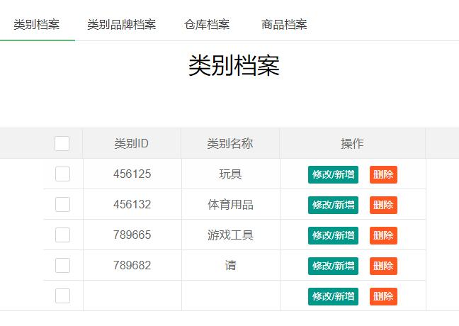
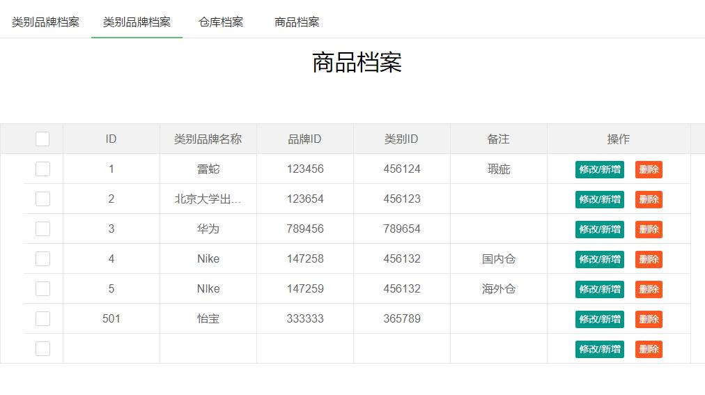
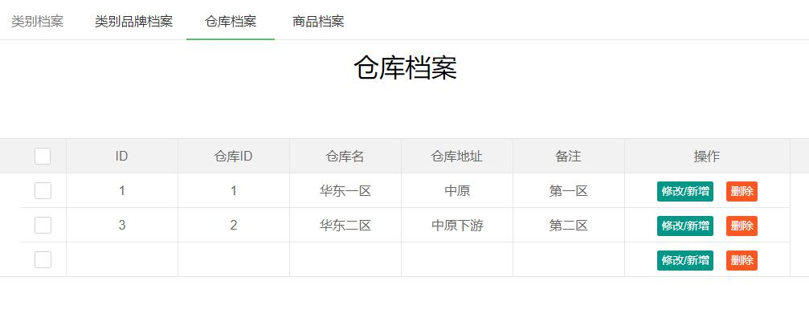
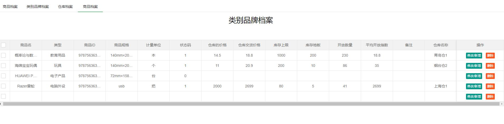
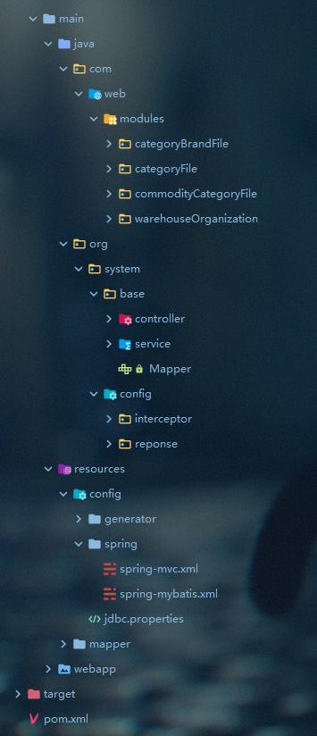
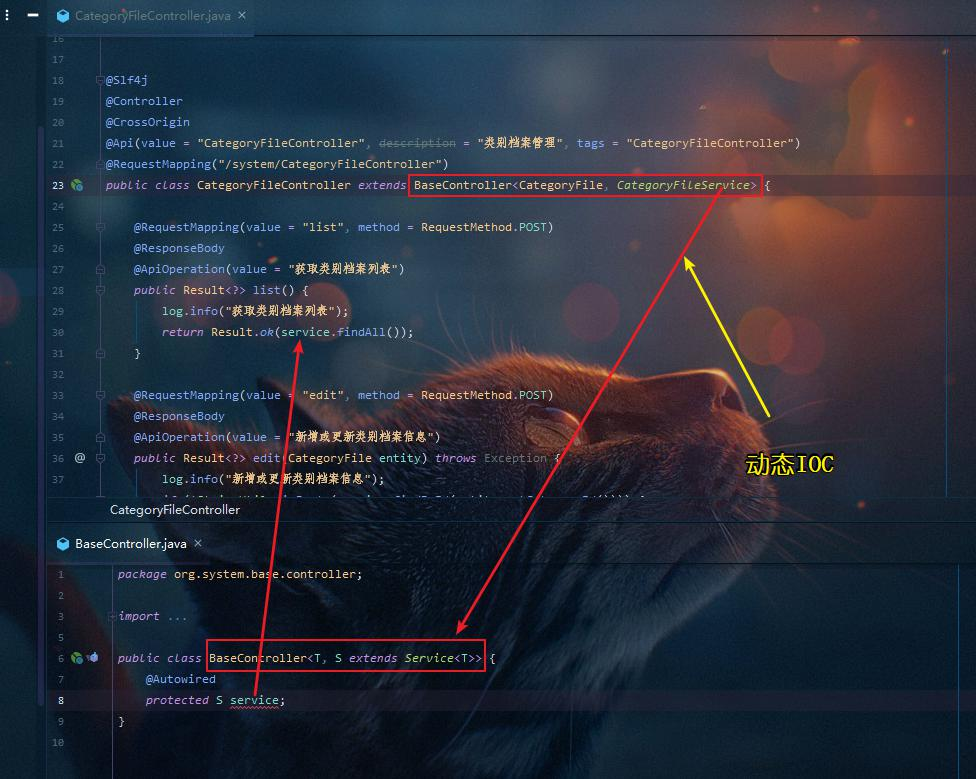
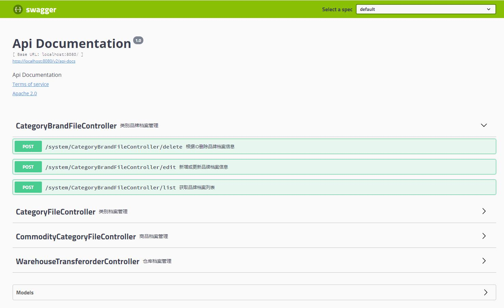

##	record_system(档案管理系统)
    档案管理系统是一个学习代码的阶段性考察而做的系统，注重代码质量，其本身的作用在某种程度上并不是特别有用的，有兴趣的可以作为参考代码。
    
---
###	1.项目介绍
 record_system 是一个档案管理系统，基于ssm框架开发，开发的主要目的是对ssm系统的回顾复习，其实用性并不是很大，但在代码风格上未尝没有借鉴意义。
 
### 2.框架介绍
#### 技术支持
1. Spring
2. Spring MVC
3. Mybatis
4. MySql 57
5. TK Mybatis
6. Swagger
7. Lombok
8. LayUI
9. generator
10. Tomcat 8
11. Slf4j
12. Maven

#### 3.项目截图

